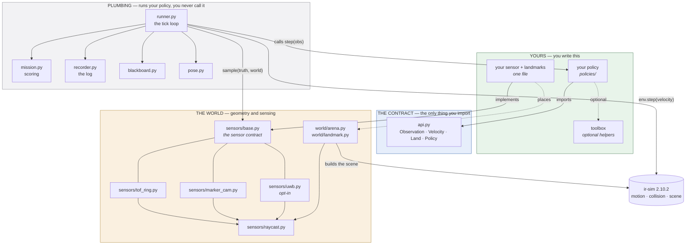
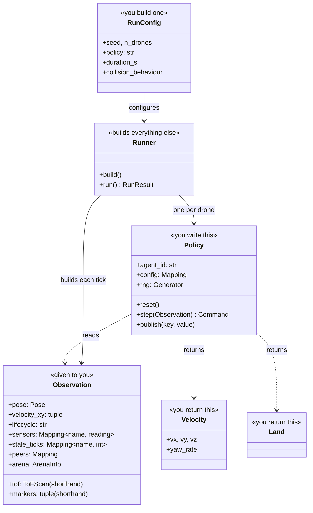
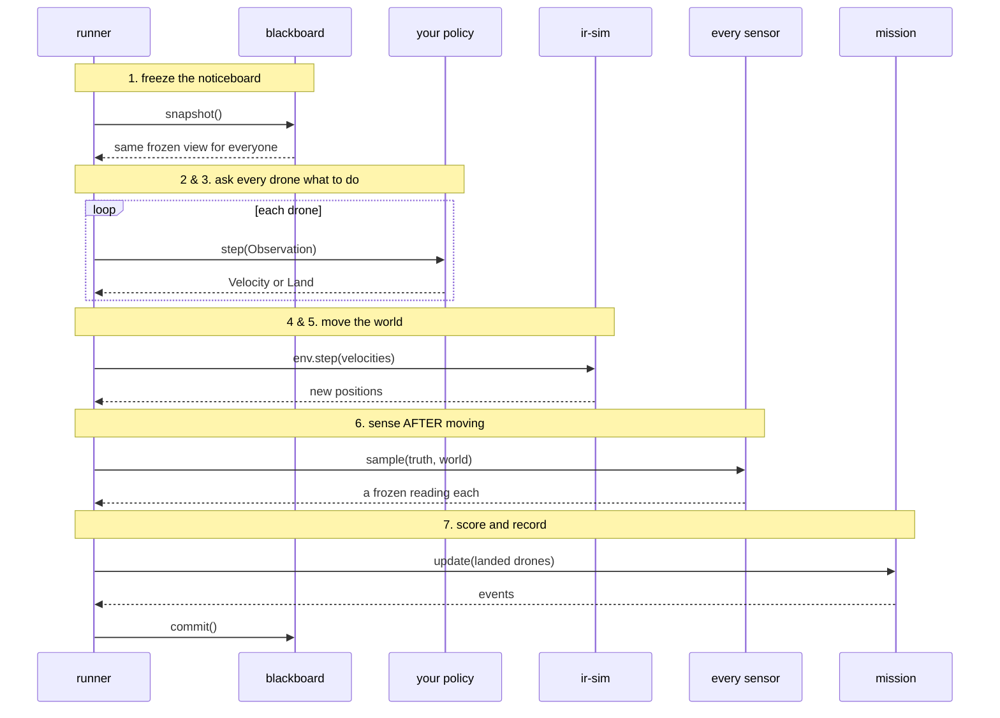
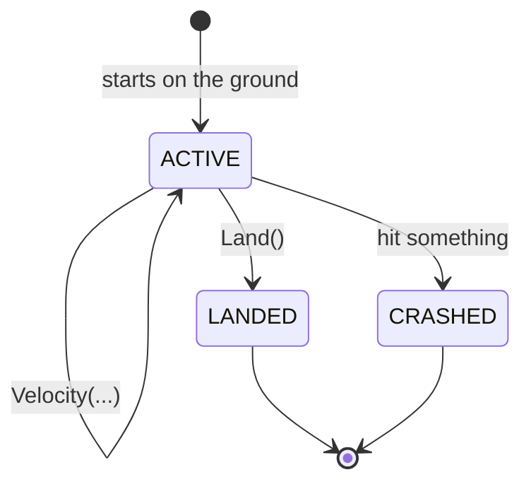

# How this codebase is put together

A map, not a tutorial. If you just want to write a search strategy, go straight to
[docs/05-policy-api.md](docs/05-policy-api.md) — you can ignore almost everything here.

This page answers: what are the pieces, which ones am I supposed to touch, and what happens
when I press run.

---

## 1. The whole thing in one picture



**Read it as four bands.** You write the green — a policy, and if you need one, a sensor with
the landmarks it perceives. You import the blue. The grey runs your code and you never call
into it. The orange is geometry — you meet it only through what your sensors report. `ir-sim`
is the library underneath that moves things and decides what bumped into what.

The orange band has one seam of its own: every sensor, flown or yours, is driven through the
contract in `sensors/base.py`, and the runner never learns what any of them are. Adding a
sensor, or a landmark for it to find, is one file —
[docs/10-adding-sensors-and-landmarks.md](docs/10-adding-sensors-and-landmarks.md).

The single rule that keeps this honest: **arrows never go up from grey into green.** No plumbing
imports your policy or the toolbox, so nothing the framework does can silently depend on a
choice a strategy made. There is a test that fails if that is ever violated.

---

## 2. The seams — which layer is which

| Layer | Where | Do you touch it? | What it is |
|---|---|---|---|
| **Your strategy** | `policies/` | **Write it** | One class, one `step()` method |
| **Optional helpers** | `toolbox.py` | **Copy or ignore** | Frame rotation, sensor reduction, a map. Nothing imports it for you |
| **The contract** | `api.py` | **Import it** | `Observation` in, `Velocity` or `Land` out |
| **Orchestration** | `runner.py` | Read if curious | Builds a run, drives the loop, records it |
| **Scoring** | `mission.py` | Read if curious | Which targets counted and why |
| **Observability** | `recorder.py`, `metrics.py`, `tools/viz.py` | Use the outputs | The log, the numbers, the replay page |
| **Deferred seams** | `pose.py`, `blackboard.py` | Extend later | Where pose noise and a lossy radio will go |
| **Sensors** | `sensors/base.py`, `sensors/tof_ring.py`, `sensors/marker_cam.py`, `sensors/uwb.py` | **Extend** | The contract every sensor implements, the two the airframe carries, and a UWB ranging tag it could carry (opt-in) |
| **Landmarks** | `world/landmark.py` | **Extend** | Things placed in the world for sensors to find: markers, nav tags, anchors |
| **The world** | `world/arena.py`, `sensors/raycast.py`, `sensors/scene.py` | Rarely | Arena generation, ray casting, the world as a sensor sees it |
| **Foundations** | `constants.py`, `frames.py`, `errors.py` | Look things up | Every published number, angle conventions, exception types |

**The seams that matter most** are `pose.py` and `blackboard.py`. Today they hand out perfect
truth: exact position, and a shared noticeboard every drone can read instantly. Real drones have
neither. Both were left as swappable pieces so that adding drift or a lossy radio later is one
new class and **zero changes to anybody's policy**. That is the whole reason they exist as
separate files rather than as two lines inside the runner.

---

## 3. What you actually instantiate

Almost nothing. You write one class; the runner builds everything else.



`Observation`, `Velocity` and `Land` are **frozen** — you cannot change them, and changing one
could not affect the simulation anyway. That is deliberate: it makes "accidentally reading or
writing something you shouldn't" a mistake you cannot make.

`Observation` carries only what a real drone could know. There is no route from it to the map,
the obstacle list, or where the targets are. A test walks every attribute reachable from one and
fails if any of those appear.

---

## 4. What happens in one tick



Three details in that order are load-bearing, and each fixes a bug that actually happened:

**The noticeboard is frozen first.** Every drone reads the same snapshot, and anything published
this tick appears next tick. Without that, drone 0's message reaches drone 1 but not the
reverse, and results would depend on the order drones happen to be numbered.

**Sensing happens after moving.** Every drone senses the same world, so nobody is measured
against a staler picture than anyone else. Every sensor — the ring, the camera, one you add —
goes through the same call; the runner does not know what any of them are.

**Landing freezes the drone in place immediately.** Not just its command — its stored velocity
too. Zeroing only the command let a drone that landed while still moving keep sliding about
12 cm, which was enough to score a target it had not actually reached.

---

## 5. A drone's life



Three states, and both endings are permanent. There is no arming, no take-off mode and no
landing mode — climbing is just an upward velocity, and deciding when to stop climbing is your
strategy's job, not the simulator's.

**`LANDED` is the interesting one.** Landing is how you score, and it spends the drone for the
rest of the run. With a dozen targets and up to 25 drones, *how many to spend and when* is the
real strategic question this simulator exists to help you answer.

---

## 6. Where you press go

| You want to | Do this |
|---|---|
| Run one strategy | `safmc-run run --import mine.py --policy mine --drones 12` |
| Compare across seeds | `safmc-run sweep --import mine.py --policy mine sdlw --seeds 0-9` |
| Watch what happened | `safmc-run replay runs/mine_s0` → opens an HTML page |
| See what's registered | `safmc-run policies --import mine.py` |
| Drive it from Python | `from safmc_sim.runner import RunConfig, run` — see [examples/](examples/) |

`--import` matters: your policy registers itself when its file is imported, and nothing imports
your file unless you say so.

---

## 7. What a run leaves behind

```
runs/mine_s0/
├── run.jsonl      the setup, every event, the final score
├── states.npz     where every drone was, every tick
├── tof.npz        what every drone's ring saw — one <sensor>.npz per recorded sensor
└── replay.html    generated on demand — open it in a browser
```

The replay page reads **only** these files. It never re-runs the simulation, which is what makes
it a genuine replay rather than a second drawing that might disagree with the first.

The score can also be recomputed from the log alone and must match exactly. Keeping both paths
and checking they agree is the point — if they ever diverge, one of them is wrong.

---

## 8. Where to read next

| If you want to | Read |
|---|---|
| **Write a strategy** | [docs/05-policy-api.md](docs/05-policy-api.md) |
| Know what the sensors report | [docs/06-sensors.md](docs/06-sensors.md) |
| **Add a sensor, or something for it to sense** | [docs/10-adding-sensors-and-landmarks.md](docs/10-adding-sensors-and-landmarks.md), [examples/03_custom_sensor.py](examples/03_custom_sensor.py) |
| Know what the competition asks for | [docs/01-competition.md](docs/01-competition.md) |
| Know what is *not* simulated | [docs/FIDELITY.md](docs/FIDELITY.md) — **read before quoting a number** |
| Understand the logs and metrics | [docs/07-logging-and-viz.md](docs/07-logging-and-viz.md) |
| Know why ir-sim, and why these seams | [docs/adr/](docs/adr/) |
| Take this to real drones | [docs/08-porting-to-ros.md](docs/08-porting-to-ros.md) |
